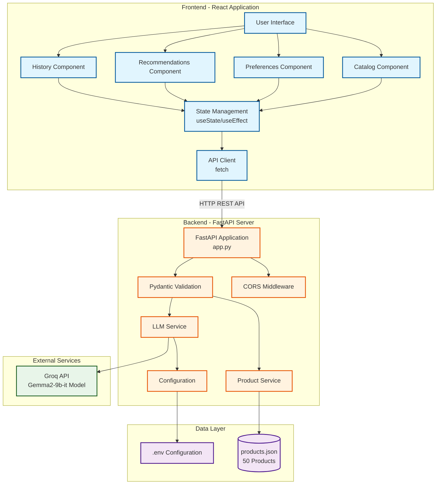

# i95dev AI Engineering Intern - Take-Home Assignment
## AI-Powered Product Recommendation Engine

### Overview

This is a full-stack AI-powered product recommendation system that leverages Large Language Models (LLMs) to generate personalized product recommendations based on user preferences and browsing history. The system demonstrates effective prompt engineering, RESTful API design, and modern React development practices.

### Architecture



### Project

#### Backend (Python)
- **RESTful API** built with FastAPI for high performance
- **LLM Integration** using Groq API with Gemma2-9b-it model
- **Smart Prompt Engineering** that generates contextual, personalized recommendations
- **Efficient Filtering** to optimize token usage and response time
- **Comprehensive Error Handling** with fallback mechanisms
- **CORS Support** for seamless frontend integration
- **Pydantic Models** for request/response validation

#### Frontend (React)
- **Product Catalog** with search, filter, and sort functionality
- **User Preferences** form with price range, category, and brand selection
- **Browsing History** tracking with visual indicators
- **AI Recommendations** display with confidence scores and explanations
- **Responsive Design** that works on all screen sizes
- **Clean UI** with loading states, error handling, and empty states

#### Project Structure
```
ai-product-recommendations/
│
├── backend/
│ ├── app.py # FastAPI application with endpoints
│ ├── config.py # Configuration and environment variables
│ ├── requirements.txt # Python dependencies
│ ├── .env # Environment variables
│ ├── data/
│ │ └── products.json # Product catalog (50 products)
│ └── services/
│ ├── llm_service.py # LLM integration and prompt engineering
│ └── product_service.py # Product data operations
│
├── frontend/
│ ├── public/
│ │ └── index.html
│ ├── src/
│ │ ├── App.js # Main React application
│ │ ├── index.js # React entry point
│ │ ├── components/
│ │ │ ├── Catalog.js # Product catalog component
│ │ │ ├── UserPreferences.js # Preferences form
│ │ │ ├── Recommendations.js # AI recommendations display
│ │ │ └── BrowsingHistory.js # Browsing history tracker
│ │ ├── services/
│ │ │ └── api.js # API client for backend
│ │ └── styles/ # Component-specific CSS files
│ └── package.json
│
└── README.md # This file
```
## Technology Stack
### Backend
- **Python 3.8+**
- **FastAPI** - Modern, fast web framework
- **Groq API** - LLM service provider
- **Pydantic** - Data validation
- **python-dotenv** - Environment variable management
- **uvicorn** - ASGI server

### Frontend
- **React 18.2** - UI framework
- **React Hooks** - State management
- **CSS3** - Styling with flexbox and grid
- **Fetch API** - HTTP requests

## Getting Started

### Prerequisites
- Python 3.8 or higher
- Node.js 14 or higher
- Groq API key (get it from [console.groq.com](https://console.groq.com))

### Backend Setup

1. **Navigate to backend directory:**
    ```bash
    cd backend
    ```
2. Create virtual environment
    ```bash
    python -m venv venv
    ```
3. Activate virtual environment:
- Windows: venv\Scripts\activate
- macOS/Linux: source venv/bin/activate
4. Install dependencies:
    ```bash
    pip install -r requirements.txt
    ```
5. Create .env file:
    ```bash
    # Create .env file in backend directory
    GROQ_API_KEY=your_groq_api_key_here
    MODEL_NAME=gemma2-9b-it
    MAX_TOKENS=1000
    TEMPERATURE=0.7
    DATA_PATH=data/products.json
    ```
6. Run the server:
    ```bash
    python app.py
    ```
    The API will be available at http://localhost:5000

### Frontend Setup
1. Navigate to frontend directory:
    ```bash
    cd frontend
    ```
2. Install dependencies:
    ```bash
    npm install
    ```
3. Start development server:
    ```
    npm start
    ```
    The application will open at http://localhost:3000

## API Endpoints
#### GET /api/products
Fetches the complete product catalog.
Response
```
    [
      {
        "id": "prod001",
        "name": "Wireless Bluetooth Headphones",
        "category": "Electronics",
        "price": 79.99,
        "rating": 4.5,
        ...
      }
    ]
```
#### POST /api/recommendations
Generates personalized product recommendations.
Request Body:
```
    {
      "preferences": {
        "priceRange": "50-100",
        "categories": ["Electronics", "Audio"],
        "brands": ["SoundWave", "TechGear"]
      },
      "browsing_history": ["prod001", "prod005", "prod010"]
    }
```

Response:
```
    {
      "recommendations": [
        {
          "product": { ... },
          "explanation": "Perfect companion for your audio setup. Features premium sound quality and long battery life.",
          "confidence_score": 9
        }
      ],
      "count": 5
    }
```

## Key Features Implementation
### Prompt Engineering Strategy
The system uses sophisticated prompt engineering to:
-  Analyze user preferences and browsing patterns
-  Generate contextually relevant recommendations
-  Provide clear, user-friendly explanations
-  Avoid generic responses through specific instruction patterns

### Smart Filtering Algorithm
- Pre-filters products based on price range
- Prioritizes preferred categories and brands
- Optimizes token usage by limiting context
- Maintains diversity in recommendations

### User Experience Features
- Real-time Search: Instant product filtering
- Visual Feedback: Viewed product indicators
- Loading States: Smooth transitions during API calls
- Error Recovery: Graceful fallbacks for API failures
- Responsive Design: Mobile-first approach

## Security Considerations
- Environment Variables: API keys stored securely
- Input Validation: Pydantic models validate all inputs
- CORS Configuration: Controlled cross-origin access
- Error Messages: Sanitized error responses

# License
This project was created as part of a technical assessment. All rights reserved.

# Author
Vansh Motiramani